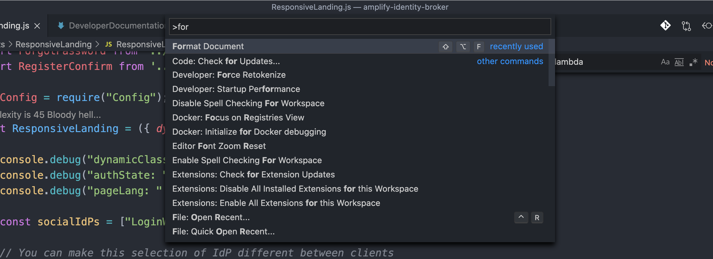
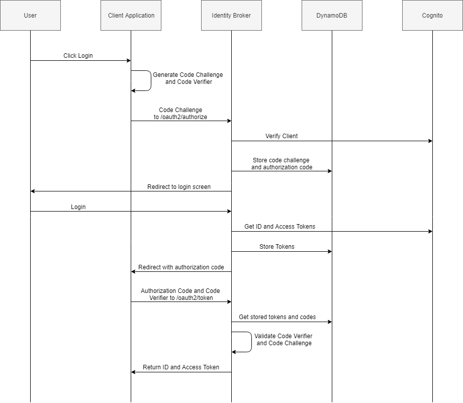
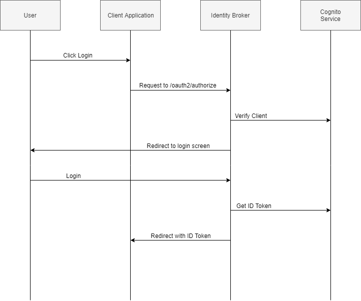
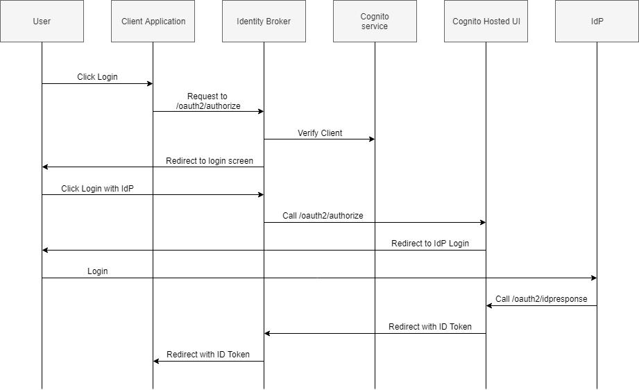
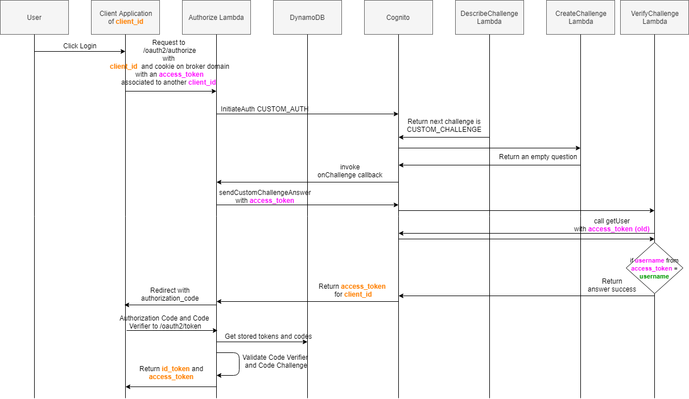

[User Documentation](UserDocumentation.md) / [Client Developer Documentation](ClientDeveloperDocumentation.md) / __[Developer Documentation](DeveloperDocumentation.md)__

# Developer Documentation <!-- omit in toc -->

- [Create your own dev environment](#create-your-own-dev-environment)
- [Architecture](#architecture)
- [Source code structure](#source-code-structure)
  - [Coding conventions](#coding-conventions)
  - [Lambda functions](#lambda-functions)
  - [Implemented auth flows](#implemented-auth-flows)
- [SSO Token Swap](#sso-token-swap)
- [Contribute](#contribute)
- [Pipelines](#pipelines)


This document is for contributors of the project.
Contribution are welcome see [CONTRIBUTING](https://github.com/awslabs/aws-amplify-identity-broker/blob/master/CONTRIBUTING.md) for information and rules of contribution

## Create your own dev environment

Follow the [deployment instructions from the user documentation](UserDocumentation.md#deployment-instructions).

If you need a client, you can use the [demo client project](https://github.com/awslabs/aws-amplify-identity-broker-client). But you should play with your browser and Postman for easier test of the flows.

## Architecture

The project architecture is the following:


## Source code structure

This is a standard AWS Amplify & React project. It has been bootstrapped using [Create React App](https://github.com/facebook/create-react-app) and the dynamic configuration is injected by [react app rewired](https://github.com/timarney/react-app-rewired).

Main code directories:

```
./src                           <-- code of the SPA
./public                        <-- static files
amplify/#current-cloud-backend  <-- current env (not in conf, in .gitignore)
amplify/backend                 <-- reference environment definition
amplify/backend/auth            <-- Cognito user pool configuration
amplify/backend/function        <-- all Lambda function code are here
amplify/backend/storage         <-- DynamoDB tables definition
amplify/backend/hosting         <-- specific Cloudfront and S3 setup
amplify/backend/kms             <-- contain the cryptographic material setup (for token encryption in DynamoDB)
```
### Coding conventions

We use [EditorConfig](https://editorconfig.org/) to apply coding conventions across the project.
If you use VSCode, make sure to install this [plugin](https://marketplace.visualstudio.com/items?itemName=EditorConfig.EditorConfig) for the editor to pick it up. If you use another IDE, I'm certain you'll find a corresponding plugin for it with a bit of googling.

After installing the plugin, every new file you create will follow the conventions setup [over here](https://github.com/awslabs/aws-amplify-identity-broker/blob/master/.editorconfig): **tabs with size 4, no trailing whitespace and with a final newline**. These conventions have been chosen to match the Amplify framework coding conventions.
You don't have to do anything else, but in case you want to make sure your document is properly formatted, you can call the "Format Document" in the commands palette




### Lambda functions

__Oauth2/OIDC functions__

* __amplifyIdentityBrokerAuthorize__: Handle the Oauth2 flows. Is invoked behind the _/oauth2/authorize_ path on the API Gateway
* __amplifyIdentityBrokerToken__: Answer to _/oauth2/token_ standard oauth calls.
* __amplifyIdentityBrokerUserInfo__: Returns standard answer to _/oauth2/userinfo_. Needs a valid JWT token
* __amplifyIdentityBrokerExposeJWKS__: Return the oauth public key used by Cognito. It is onvoked behind /.well-known/jwks.json

* __amplifyIdentityBrokerAccountConfirmation__: This is mapped to _/accountConfirmation_ path which is the link provided in confirmation emails. This activate the user account.

__SPA backend functions__

* __amplifyIdentityBrokerStorage__: Is used by the SPA to store code_challenge and token temporarily during oauth flow execution.
* __amplifyIdentityBrokerVerifyClient__: Is used by the SPA to check if a pair _redirect_uri_ + _client_id_ is valid. It looks in the DynamoDB table amplifyIdentityBrokerClientsTable to do so

__Cognito Trigger functions__

* __amplifyIdentityBrokerCustomMessage__: Is invoked before sending any email to the user. It is associated to the [Custom message Lambda Trigger](https://docs.aws.amazon.com/cognito/latest/developerguide/user-pool-lambda-custom-message.html) of the Cognito user pool.
* __amplifyIdentityBrokerMigration__: Is not invoked by default. This is just an example of how to do a migration. Can be associated to the [Migrate user trigger](https://docs.aws.amazon.com/cognito/latest/developerguide/user-pool-lambda-migrate-user.html)
* __amplifyIdentityBrokerDefineAuthChallenge__: Is invoked during the token swap operation (see detail in _SSO Token Swap_ section). This one define the challenge execution order.
* __amplifyIdentityBrokerVerifyAuthChallenge__: Is invoked during the token swap operation (see detail in _SSO Token Swap_ section). This one validate the original token and return success if the username (sub, the Amazon Cognito ID) from the current flow is the same than the one in the token. 
* __amplifyIdentityBrokerCreateAuthChallenge__: Is invoked during the token swap operation (see detail in _SSO Token Swap_ section). This does nothing but is required in a custom flow.

__Utils functions__
* __amplifyIdentityBrokerPostDeployment__: Is a CloudFormation custom resources that depends on most of Api, Auth and all Functions. It receive the balue of the hosting (the cloudfront domain) the UserPool ID and apps and update the configuration of Cognito app with callback that match. It also inject the HOSTING_DOMAIN environment variable for all functions. The domain value can be override in `team-provider-info.json` with `hostingDomain` (see user documentation). Also this domain is propagated to frontend by `config-overrides.js`

### Implemented auth flows

<details>
  <summary>Click to expand!</summary>


  Flow entities are:
  * __User__: the user and his browser
  * __Client Application__: (like the one from our [client demo project](https://github.com/awslabs/aws-amplify-identity-broker-client))
  * __Identity Broker__ : the main project
  * __DynamoDB__: the broker storage layer
  * __Cognito__: The Cognito service and endpoints
  * __Cognito Hosted UI__: (not visible to the user)
  * __Idp__: Any 3rd party identity provider (in the case of federation)

  __PKCE flow__

  

  __Implicit flow__

  

  _Note: Accordingly to the [what the Oauth2 BCP recommend](https://tools.ietf.org/html/draft-ietf-oauth-security-topics-09#section-2.1.2) we do not return the access_token in that flow but only the id_token._

  __IDP federation flow__

  

  _Note: The end of the flow (the return to the AWS Amplify broker client will be done accordingly to the client selected flow: PKCE or Implicit)_
</details>

## SSO Token Swap

Every client application will get a token associated to the client_id he owns. Doing this make sure that the token are distributed to the right OIDC Audience, and also allow users to customize the scope and list of IdP they want to activate for a given client.

When a login happen in the broker it is always done with a given client_id. This client_id maybe one from the client application the user came from, or the one of the broker if the user navigate directly to the brokjer domain. Once a user login, the broker store the tokens (ID, access, refresh) in localstorage and in a cookie on the broker domain.

Now, if after a first successfull login, the same user come from another client application. Because of SSO he will be considered logged in but we cannot give him the current token since it is not a token matching with the client_id of the client application. Thanks to Amazon Cognito triggers and custom auth flow exchanging a token from one client_id to another is possible.
This is the flow followed during this swap (here when coming from a PKCE client):

  
  
__Note:__ _It could have ben possible to reduce the complexity of this flow by relying on the Amazon Cognito hosted UI to swap the tokens. In fact the hosted UI will do the token SWAP if a user browser come back with an existing valid token in a cookie. We chose not relying on that because if for any reason the cookie is not there (on the hosted UI domain) the user will be presented the Amazon Cognito hosted UI which we want to absolutely prevent._

## Contribute

PR are welcome. Any fixes or improvements. For new features, please open an issue to discuss it.

See [CONTRIBUTING](https://github.com/awslabs/aws-amplify-identity-broker/blob/master/CONTRIBUTING.md) for more rules and information.

_Please do not update team-provider-info.json in your Pull-Requests._

## Pipelines

You are free to create your own pipeline for your environments.
If you are an AWS employee, go to the internal wiki for details.
