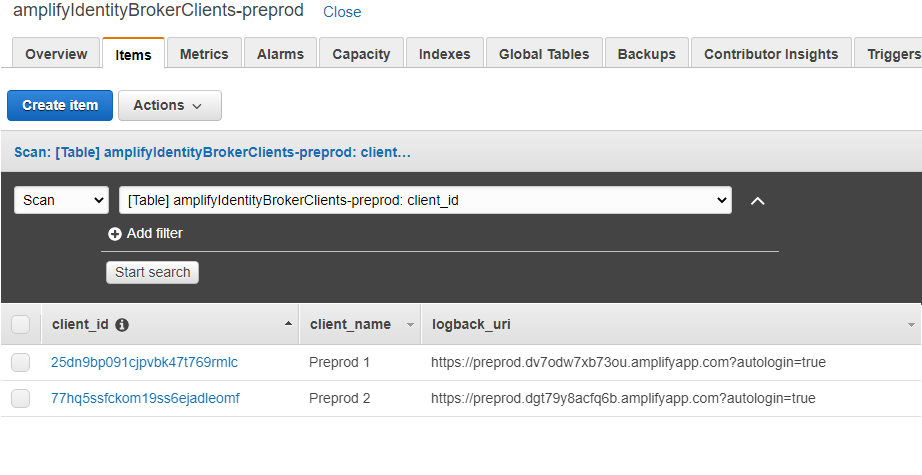
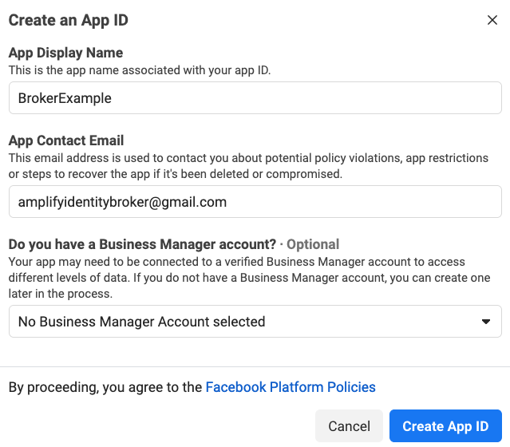

# User Documentation

This document explains how to use the broker:

* How to deploy
* How to customize
* How to migrate from an existing user pool system

## Presentation and feature overview

### Example use cases 

### Choose your flow

## Deployment

### Architecture

The project architecture is the following:


See __[Developer Documentation](DeveloperDocumentation.md)__ to see more detailed information on every component. 

__COST__ The project architecture is Serverless, you only pay when there is user activity plus a small amount of storage (website static assets, dynamodb tables). Overall the solution is very cost effective. Amazon Cognito will be the primary source of cost, see [Amazon Cognito pricing](https://aws.amazon.com/cognito/pricing/) to estimate your costs.

### Deployment instruction

__Prerequisites :__ In order to deploy the solution you need:
* an AWS account
* the AWS CLI installed with administrator credentials (instruction-link)
* the Amplify CLI (instruction-link)

1. Clone the project or fork it

2. Install all the dependencies

```
cd amplify-identity-broker
npm install
```

2. Select the deployment options and parameters

TBD config-overide.js+ ???

3. Delete the AWS demo environemnt file

Remove the file with the AWS dev & demo environment (amplify will create a new file with your environment information later)

```
rm -f ./amplify/team-provider-info.json
```

4. Initialise your environment

_You need to have the AWS cli and AWS credentials in place before running this_

```
amplify init
```
Name the environment whatever you like.

5. Publish the app

This command will create all the backend resources and the hosting bucket plus cloudfront distribution that will host the broker:

```
amplify publish
```


__Setup your own domain__

## Register a client
To use the indentity broker you must register a client_id and redirect_uri with the `amplifyIdentityBrokerClients` DynamoDB table. These values are passed as query string paramters when a request is made to the /oauth2/authorize endpoint and then checked agaisnt the table.

To register your client, create an item in the `amplifyIdentityBrokerClients` DynamoDB with a client_id and the redirect_uri of your client application. Below is an example of a registered client



__IMPORTANT__ The client ids have to match what you use in the clientId parameter on your client applications.


## CSS & UI components customization instruction

The Broker code is based on _React_, _aws-amplify_ and _@aws-amplify/ui-react_. While you can customize the CSS, JS and HTML anyway you want, we provide here several tips to make your change more efficients and easier to maintain.

We use CSS Variables to setup the color of the project.

In the file _src/index.css_ we set the root color like that:

```
:root{

  --amplify-primary-color: #008000;
  --amplify-primary-tint: #0000FF; 
  --amplify-primary-shade: #008000;
}
```

For more option on the Amplify UI component look at the [Documentation](https://docs.amplify.aws/ui/customization/theming/q/framework/react)

We've define all CSS extra properties in _src/index.css_, look at this file before any overide.

## Add Identity Providers

__PREREQUISITE__: 
In order to have the external IdP working you need to setup a subdomain (or a domain) for the COgnito user pool that the broker use.
In the AWS console go to _Cognito_ -> _User Pool_ -> _brokeruserpool-<YOUR ENVIRONMENT NAME>_
In the left menu go to _APP Integration_ -> _Domain Name_ and enter a unique subdomain.
  
_The user will see this domain name only very briefly during redirection, you probably don't need to set a real domain. But if you need to follow the [Cognito Documentation](https://docs.aws.amazon.com/cognito/latest/developerguide/cognito-user-pools-add-custom-domain.html)_

Take note of the domain for next steps.

To add identity providers, you need to insert these provider under the file _config-overrides.js_ whih is at the root of the project.
You have to add the settings on the environment you like to modify.

Example:

```
        case "production": localConfig = {
            "providers": ["Provider1", "Provider2", "LoginWithAmazon", "Facebook", "Google"],
            "hostedUIUrl": "https://<YOUR DOMAIN NAME>.auth.us-west-2.amazoncognito.com",
          };
            break;
```

Be exact with the name of your providers.

Note that the label that appear in the button is displayed using the i18n Amplify system. If you want to change the name edit the file _src/strings.js_ and create label that match your provider name.
Example:

```
        Provider1: "Sign In with first provider",
        Provider2: "Sign In with another provider",
        AMAZON_SIGNIN: "Sign In with Amazon",
        GOOGLE_SIGNIN: "Sign In with Google",
        FACEBOOK_SIGNIN: "Sign In with Facebook",
```

See next sections for specific provider steps.

### OIDC Provider (oauth2)

### SAML Provider

### Social Providers

Social Provider instructions taken from [Cognito Documentation](https://docs.aws.amazon.com/cognito/latest/developerguide/cognito-user-pools-social-idp.html). 

<details>
  <summary>Facebook</summary>

### Step 1: Register with Facebook

1. Create a developer account with [Facebook](https://developers.facebook.com/docs/facebook-login). 
2. [Sign in](https://developers.facebook.com) with your Facebook credentials. 
3. From the __My Apps__ menu, choose __Create New App.__ 


4. Select __For Everything Else,__ give your Facebook app a name and choose __Create App ID.__





5. On the left navigation bar, choose __Settings__ and then __Basic__.
6. Note the __App ID__ and the __App Secret.__ You will use them in the next section. 
7. Choose __+ Add Platform__ from the bottom of the page. 
8. Choose __Website__
9. Under __Website,__ type your user pool domain with the /oauth2/idpresponse endpoint into Site URL. 


10. Choose __Save changes__
11. Type your user pool domain into __App Domains__


12. Choose __Save changes.__
13. From the navigation bar choose __Products__ and then __Set up__ from __Facebook Login.__ 
14. From the navigation bar choose __Facebook Login__ and then __Settings.__ 
Type your redirect URL into __Valid OAuth Redirect URIs.__ It will consist of your user pool domain with the /oauth2/idpresponse endpoint. 


15. Choose __Save changes.__

### Step 2: Add Facebook to Your User Pool

1. Go to the [Amazon Cognito console](https://console.aws.amazon.com/cognito/home)
2. Choose __Manage your User Pools.__
3. Choose the User Pool created as part of the Amplify deployment
4. On the left navigation bar, choose __Identity providers__
5. Select __Facebook__
6. Type the __app client ID__ and __app client secret__ you recived from the previous section
7. Type the names to the scopes you want to authorize seperated by commas


8. Choose __Enable Facebook__
9. On the left navigation bar, choose __Attribute Mapping__
10. Select the __Facebook__ tab
11. Capture and map the required user attributes


12. Choose __Save Changes__

</details>

<details>
  <summary>Google</summary>

### Step 1: Register with Google

1. Create a developer account with Google. 
2. [Sign in](https://console.developers.google.com) with your Google credentials. 
3. Choose __Create Project__


4. Type in a project name and choose __Create__ 
5. On the left navigation bar, choose __OAuth consent screen__
6. Select your User Type and choose __Create__


7. Type in an application name and choose __Save__
8. On the left navigation bar, choose __Credentials__
9. Create your OAuth 2.0 credentials by choosing __OAuth client ID__ from the __Create credentials__ drop-down list.


10. Choose __Web application.__
11. Type your user pool domain into __Authorized JavaScript origins.__
12. Type your user pool domain with the __/oauth2/idpresponse__ endpoint into __Authorized Redirect URIs.__


13. Choose Create.
14. Note the OAuth client ID and client secret. You will need them for the next section.
15. Choose OK.

</details>

<details>
  <summary>Amazon</summary>
  
1. 

</details>

## Migration instructions
