# User Documentation

This document explains how to use the broker:

* How to deploy
* How to customize
* How to migrate from an existing user pool system

## Presentation and feature overview

The AWS Amplify Identity Broker is a centralized login solution. It is a component you can use to authenticate your user on all your websites and applications:


The broker will be deployed within your own AWS account and will be in your full control (see _Deployment_ section).

Using the broker your users will have the same unique identity accross all your websites and applications. The broker provides Single Sign On (SSO): your users will have to login only once to be authenticated on all your services (but can have different permission levels specific to every application).

Optionaly you can add external IdP (Identity Providers) to the broker. Which means that the user can sign-in using your corporate (or your customer corporate) Active Directory or using Facebook, Google or Amazon login or any OIDC and SAML IdP. Technically you can add up to 300 IdPs to your broker (limit coming from Cognito documented [here](https://docs.aws.amazon.com/cognito/latest/developerguide/limits.html)). Today user coming from any client will see the same list of IdPs but you can fork the broker project and customize the behavior to make the list dynamic and for example:

* show the corporate IdP to people accessing the broker from your office private network
* show a list of IdP specific to a customer by giving them a special URL (like a link with a get parameter flag)
* show a list of IdP specific to a client application

__Note that even if your users login in with a 3rd party IdP they will have a unique and peristent identity within the broker__ (under the hood a Cognito user pool identity).

In term of UI customization because you are in control of the source code and the deployment infrastructure you can make any change you like.
The same applies for flow customization where all the front end part are customizable using the broker and backend flows can be customized using [Cognito Lambda Triggers](https://docs.aws.amazon.com/cognito/latest/developerguide/cognito-user-identity-pools-working-with-aws-lambda-triggers.html). The broker already leverage some of these triggers to introduce special feature like i18n (internationalization).

Finaly the broker is a living open source project and your contributions are welcome if you see a missing feature that can be useful to all the broker users. Please see the [Developer Documentation](./DeveloperDocumentation.md) if you are interested by contributing.

### Choose your flow

Selecting an authentication flow is a critical decision in term of security. We support several options to allow you connecting existing application that supports only one specific flow.

The AWS Amplify identity broker exposes two standard Oauth2 authentication flows:
* __Implicit flow__: the simpler one. It require just a link from your app and for you to read a GET parameter. This flow only returns an _id_token_ you __should not__ use an id_token to authenticate a user against a backend. (see details below)
* __PKCE flow__: the most secured flow. It will require you to generate random strings, apply some hashed and exchange information two times with the broker.

Expand the section below to see the detailed flows:

<details>
  <summary>Implicit flow</summary>
  
  Flow entities are:
  * __User__: the user and his browser
  * __Client Application__: (like the one from our [client demo project](https://github.com/awslabs/aws-amplify-identity-broker-client))
  * __Identity Broker__ : the main project
  * __DynamoDB__: the broker storage layer
  * __Cognito__: The Cognito service and endpoints
  
  __Implicit flow__
  
  
  
  _Note: Accordingly to the [what the Oauth2 BCP recommend](https://tools.ietf.org/html/draft-ietf-oauth-security-topics-09#section-2.1.2) we do not return the access_token in that flow but only the id_token._
</details>

<details>
  <summary>PKCE flow</summary>
  
  Flow entities are:
  * __User__: the user and his browser
  * __Client Application__: (like the one from our [client demo project](https://github.com/awslabs/aws-amplify-identity-broker-client))
  * __Identity Broker__ : the main project
  * __DynamoDB__: the broker storage layer
  * __Cognito__: The Cognito service and endpoints
  
  
  
</details>

See [Client Developer Documentation](./ClientDeveloperDocumentation.md) to see how to implement a client using these flows.

## Deployment

### Architecture

The project architecture is the following:


See __[Developer Documentation](DeveloperDocumentation.md)__ to see more detailed information on every component. 

__COST__ The project architecture is Serverless, you only pay when there is user activity plus a small amount of storage (website static assets, dynamodb tables). Overall the solution is very cost effective. Amazon Cognito will be the primary source of cost, see [Amazon Cognito pricing](https://aws.amazon.com/cognito/pricing/) to estimate your costs.

### Deployment instruction

__Prerequisites :__ In order to deploy the solution you need:
* an AWS account
* the AWS CLI installed with administrator credentials (instruction-link)
* the Amplify CLI (instruction-link)

1. Clone the project or fork it

2. Install all the dependencies

```
cd amplify-identity-broker
npm install
```

2. Select the deployment options and parameters

TBD config-overide.js+ ???

3. Delete the AWS demo environemnt file

Remove the file with the AWS dev & demo environment (amplify will create a new file with your environment information later)

```
rm -f ./amplify/team-provider-info.json
```

4. Initialise your environment

_You need to have the AWS cli and AWS credentials in place before running this_

```
amplify init
```
Name the environment whatever you like.

5. Publish the app

This command will create all the backend resources and the hosting bucket plus cloudfront distribution that will host the broker:

```
amplify publish
```


__Setup your own domain__

## Register a client
To use the indentity broker you must register a client_id and redirect_uri with the `amplifyIdentityBrokerClients` DynamoDB table. These values are passed as query string paramters when a request is made to the /oauth2/authorize endpoint and then checked agaisnt the table.

You can decide any client id you like. For example _my_application_1_ or _7b5a0ffb1dc505d5fddff331af665fb9f6d90e58_ are valid client ids.

To register your client, create an item in the `amplifyIdentityBrokerClients` DynamoDB with a client_id and the redirect_uri of your client application. Below is an example of a registered client


__IMPORTANT__ The client ids have to match what you use in the clientId parameter on your client applications.


## CSS & UI components customization instruction

The Broker code is based on _React_, _aws-amplify_ and _@aws-amplify/ui-react_. While you can customize the CSS, JS and HTML anyway you want, we provide here several tips to make your change more efficients and easier to maintain.

We use CSS Variables to setup the color of the project.

In the file _src/index.css_ we set the root color like that:

```
:root{

  --amplify-primary-color: #008000;
  --amplify-primary-tint: #0000FF; 
  --amplify-primary-shade: #008000;
}
```

For more option on the Amplify UI component look at the [Documentation](https://docs.amplify.aws/ui/customization/theming/q/framework/react)

We've define all CSS extra properties in _src/index.css_, look at this file before any overide.

## Add Identity Providers

__PREREQUISITE__: 
In order to have the external IdP working you need to setup a subdomain (or a domain) for the Cognito user pool that the broker use.
In the AWS console go to _Cognito_ -> _User Pool_ -> _brokeruserpool-<YOUR ENVIRONMENT NAME>_
In the left menu go to _APP Integration_ -> _Domain Name_ and enter a unique subdomain.
  
_The user will see this domain name only very briefly during redirection, you probably don't need to set a real domain. But if you need to follow the [Cognito Documentation](https://docs.aws.amazon.com/cognito/latest/developerguide/cognito-user-pools-add-custom-domain.html)_

Take note of the domain for next steps.

To add identity providers, you need to insert these provider under the file _config-overrides.js_ whih is at the root of the project.
You have to add the settings on the environment you like to modify.

Example:

```
        case "production": localConfig = {
            "providers": ["Provider1", "Provider2", "LoginWithAmazon", "Facebook", "Google"],
            "hostedUIUrl": "https://<YOUR DOMAIN NAME>.auth.us-west-2.amazoncognito.com",
          };
            break;
```

Be exact with the name of your providers.

Note that the label that appear in the button is displayed using the i18n Amplify system. If you want to change the name edit the file _src/strings.js_ and create label that match your provider name.
Example:

```
        Provider1: "Sign In with first provider",
        Provider2: "Sign In with another provider",
        AMAZON_SIGNIN: "Sign In with Amazon",
        GOOGLE_SIGNIN: "Sign In with Google",
        FACEBOOK_SIGNIN: "Sign In with Facebook",
```

See next sections for specific provider steps.

### OIDC Provider (oauth2)

### SAML Provider

### Social Providers

Social Provider instructions taken from [Cognito Documentation](https://docs.aws.amazon.com/cognito/latest/developerguide/cognito-user-pools-social-idp.html). 

<details>
  <summary>Facebook</summary>

### Step 1: Register with Facebook

1. Create a developer account with [Facebook](https://developers.facebook.com/docs/facebook-login). 
2. [Sign in](https://developers.facebook.com) with your Facebook credentials. 
3. From the __My Apps__ menu, choose __Create New App.__ 


4. Select __For Everything Else,__ give your Facebook app a name and choose __Create App ID.__


5. On the left navigation bar, choose __Settings__ and then __Basic__.
6. Note the __App ID__ and the __App Secret.__ You will use them in the next section. 
7. Choose __+ Add Platform__ from the bottom of the page. 
8. Choose __Website__
9. Under __Website,__ type your user pool domain with the /oauth2/idpresponse endpoint into Site URL. 


10. Choose __Save changes__
11. Type your user pool domain into __App Domains__


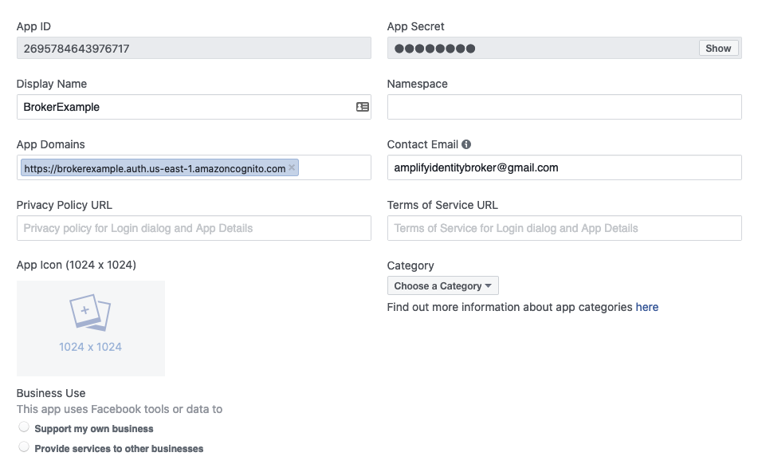


12. Choose __Save changes.__
13. From the navigation bar choose __Products__ and then __Set up__ from __Facebook Login.__ 
14. From the navigation bar choose __Facebook Login__ and then __Settings.__ 
Type your redirect URL into __Valid OAuth Redirect URIs.__ It will consist of your user pool domain with the /oauth2/idpresponse endpoint. 


15. Choose __Save changes.__

### Step 2: Add Facebook to Your User Pool

1. Go to the [Amazon Cognito console](https://console.aws.amazon.com/cognito/home)
2. Choose __Manage your User Pools.__
3. Choose the User Pool created as part of the Amplify deployment
4. On the left navigation bar, choose __Identity providers__
5. Select __Facebook__
6. Type the __app client ID__ and __app client secret__ you recived from the previous section
7. Type the names of the scopes you want to authorize seperated by commas


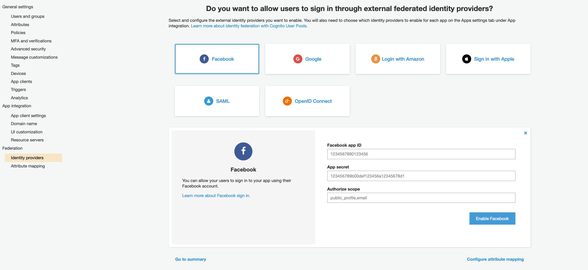


8. Choose __Enable Facebook__
9. On the left navigation bar, choose __Attribute Mapping__
10. Select the __Facebook__ tab
11. Capture and map the required user attributes


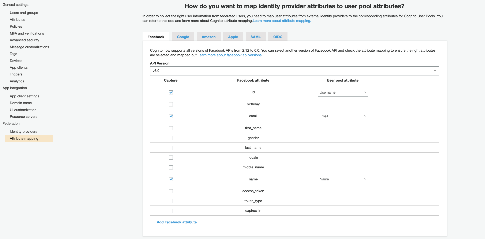


12. Choose __Save Changes__

</details>

<details>
  <summary>Google</summary>

### Step 1: Register with Google

1. Create a [developer account with Google.](https://developers.google.com/identity)
2. [Sign in](https://console.developers.google.com) with your Google credentials. 
3. Choose __Create Project__


4. Type in a project name and choose __Create__ 
5. On the left navigation bar, choose __OAuth consent screen__
6. Select your User Type and choose __Create__


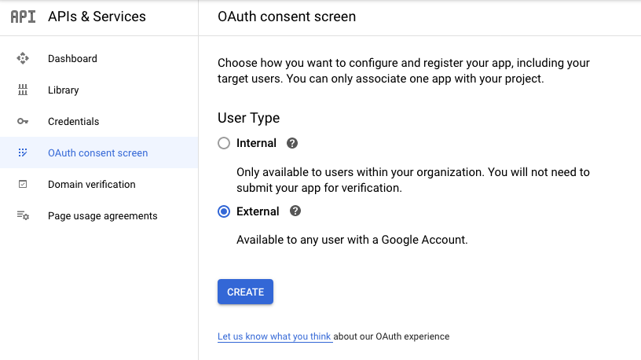


7. Type in an application name and choose __Save__
8. On the left navigation bar, choose __Credentials__
9. Create your OAuth 2.0 credentials by choosing __OAuth client ID__ from the __Create credentials__ drop-down list.


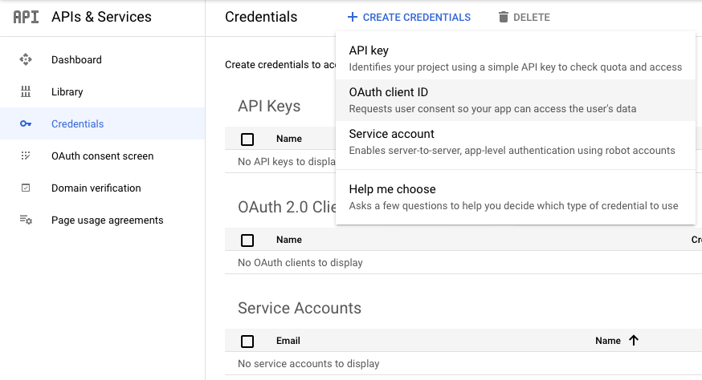


10. Choose __Web application.__
11. Type your user pool domain into __Authorized JavaScript origins.__
12. Type your user pool domain with the __/oauth2/idpresponse__ endpoint into __Authorized Redirect URIs.__


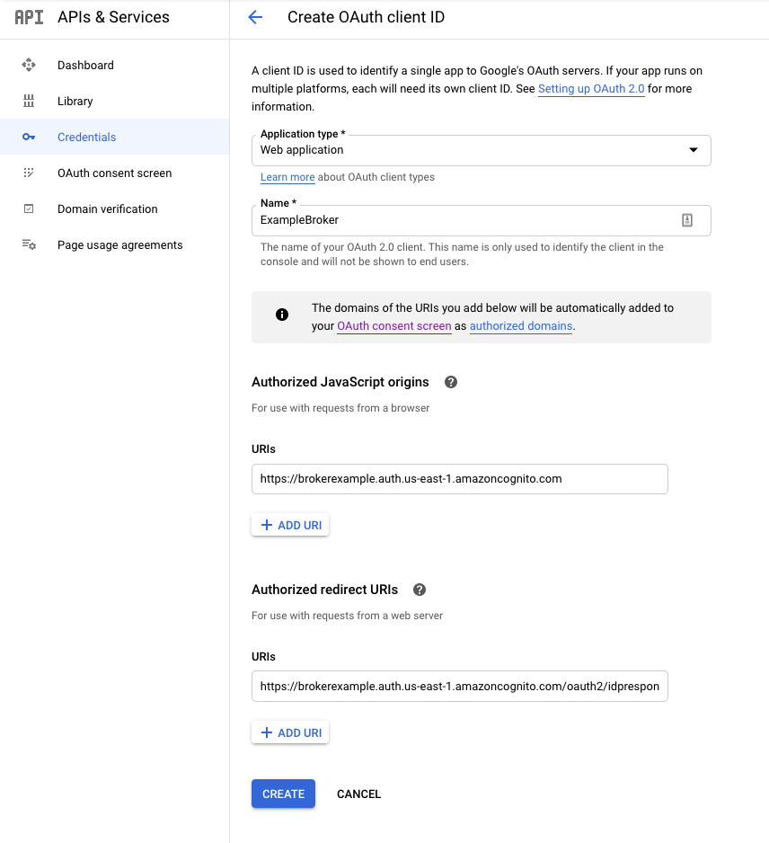

13. Choose __Create.__
14. Note the __OAuth client ID__ and __client secret.__ You will need them for the next section.
15. Choose __OK.__

### Step 2: Add Google to Your User Pool

1. Go to the [Amazon Cognito console](https://console.aws.amazon.com/cognito/home)
2. Choose __Manage your User Pools.__
3. Choose the User Pool created as part of the Amplify deployment
4. On the left navigation bar, choose __Identity providers__
5. Select __Google__
6. Type the __app client ID__ and __app client secret__ you recived from the previous section
7. Type the names of the scopes you want to authorize seperated by spaces


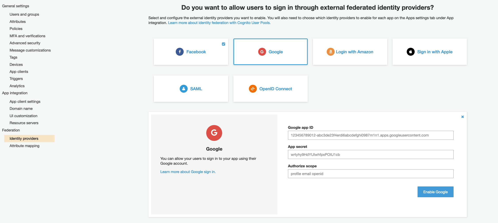


8. Choose __Enable Google__
9. On the left navigation bar, choose __Attribute Mapping__
10. Select the __Google__ tab
11. Capture and map the required user attributes


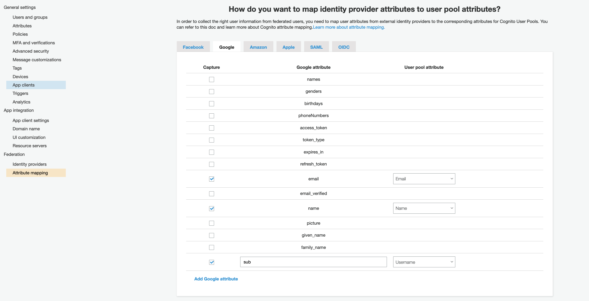


12. Choose __Save Changes__

</details>

<details>
  <summary>Amazon</summary>
  
### Step 1: Register with Amazon

1. Create a [developer account with Amazon.](https://developer.amazon.com/login-with-amazon)
2. [Sign in](https://developer.amazon.com/dashboard) with your Amazon credentials.
3. You need to create an Amazon security profile to receive the Amazon client ID and client secret. Choose __Apps and Services__ from navigation bar at the top of the page and then choose __Login with Amazon.__
4. Choose __Create a Security Profile.__

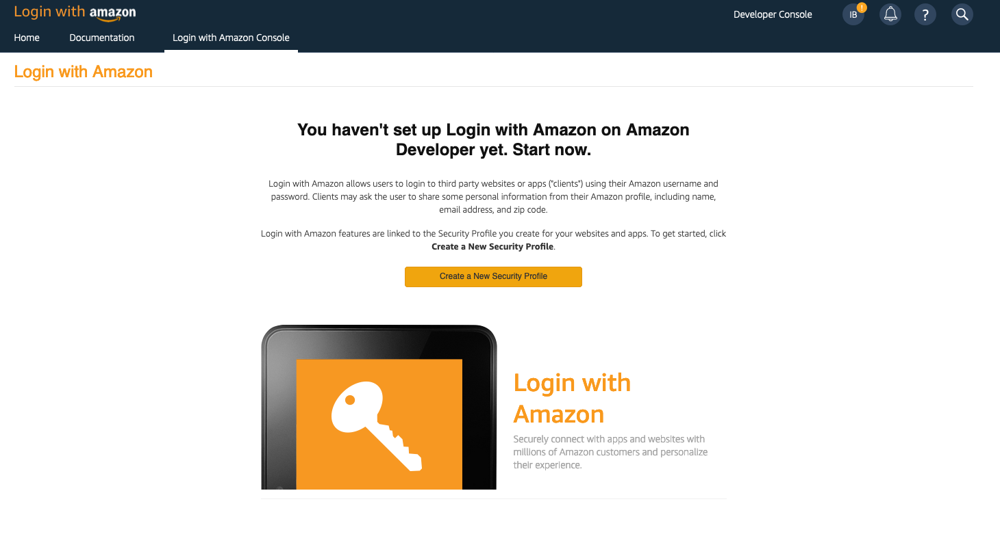


5. Type in a __Security Profile Name,__ a __Security Profile Description,__ and a __Consent Privacy Notice URL.__
6. Choose __Save.__
7. Choose __Client ID__ and __Client Secret__ to show the client ID and secret. You will use them in the next section. 
8. Hover over the gear and choose __Web Settings,__ and then choose __Edit.__ 
9. Type your user pool domain into __Allowed Origins.__ 
10. Type your user pool domain with the __/oauth2/idpresponse__ endpoint into __Allowed Return URLs.__


11. Choose __Save.__

### Step 2: Add Amazon to Your User Pool

1. Go to the [Amazon Cognito console](https://console.aws.amazon.com/cognito/home)
2. Choose __Manage your User Pools.__
3. Choose the User Pool created as part of the Amplify deployment
4. On the left navigation bar, choose __Identity providers__
5. Select __Login with Amazon__
6. Type the __app client ID__ and __app client secret__ you recived from the previous section
7. Type the names of the scopes you want to authorize seperated by spaces


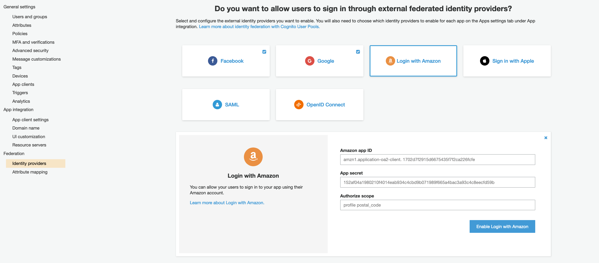


8. Choose __Enable Login with Amazon__
9. On the left navigation bar, choose __Attribute Mapping__
10. Select the __Amazon__ tab
11. Capture and map the required user attributes


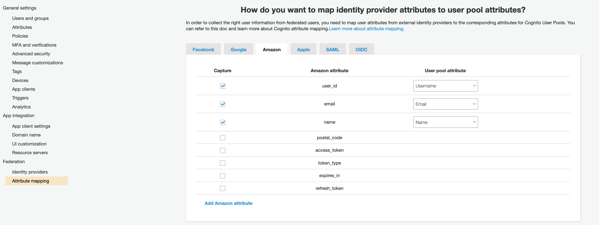


12. Choose __Save Changes__


</details>

## Migration instructions

__PREREQUISITE__: 
In order for the User Migration to be successful, We need to make sure that the Lambda code is probably set for your specific existing userpool. Currently the Lambda user-migration function is setup for migrating from the existing Cognito userpool to the current Cognito userpool for demonstration purposes.

[Lambda User Migration Code](https://github.com/awslabs/aws-amplify-identity-broker/blob/5e348800fb22b6c9f91d471f139f85e3eea38a54/amplify/backend/function/amplifyIdentityBrokerMigration/src/index.js)

[Migration Documentation](https://docs.aws.amazon.com/cognito/latest/developerguide/user-pool-lambda-migrate-user.html#cognito-user-pools-lambda-trigger-syntax-user-migration)

[Cognito SDK Documention](https://docs.aws.amazon.com/AWSJavaScriptSDK/latest/AWS/CognitoIdentityServiceProvider.html)


__Linking the Trigger__:
To use the user migration that is labeled `amplifyIdentityBrokerMigration`, the following setting needs to be enable

1. In the AWS console go to _Cognito_ -> _User Pool_ -> _brokeruserpool 

2. On the left side menu navigate to Triggers


  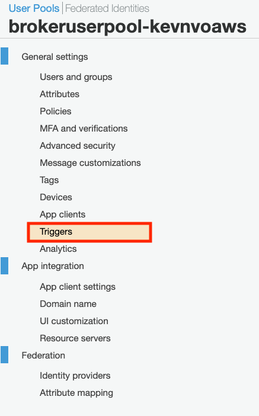

3. In the User Migration click the dropdown list and select Lambda function, if you are using the pre-built one with this project it should be label `amplifyIdentityBrokerMigration-YourENV`


  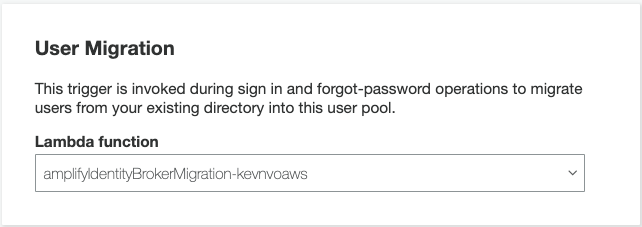

__Important__:
Your app sends the username and password to Amazon Cognito. If your app has a native sign-in UI and uses the Cognito Identity Provider SDK, your app must use the USER_PASSWORD_AUTH flow, in which the SDK sends the password to the server (your app must not use the default USER_SRP_AUTH flow since the SDK does not send the password to the server in the SRP authentication flow). The USER_PASSWORD_AUTH flow is enabled by setting AuthenticationDetails.authenticationType to "USER_PASSWORD".
 [Switch Authentication Flows](https://docs.amplify.aws/lib/auth/switch-auth/q/platform/js)

 If you like to set a migration flow for a specfic enviroment, follow the these steps:

 1. After your calling your imports in src/App.js of your react frontend, the use the following example.

    Example:
    ```
    Amplify.configure({...awsconfig, 
      Auth: {
        // OPTIONAL - Manually set the authentication flow type. Default is 'USER_SRP_AUTH'
        authenticationFlowType: Config.authenticationFlowType !== undefined ? Config.authenticationFlowType : "USER_SRP_AUTH",
      },
    });
    ```
    This will detect if your authenticationFlowType have been set or not yet, if the authenticationFlowType has not been set then USER_SRP_AUTH will be the assigned flow.

  2. Lastly we need to set the "USER_PASSWORD" flow to the desired enviroment, navigate to config-overrides.js in the root folder and set code with the following example.

      Example:
      ```
      case "Your-ENV": localConfig = {
            // This is added to any ENV that want to use User-Migration, the authenication flow type need to be set to USER_PASSWORD_AUTH from default(USER_SRP_AUTH)
            "authenticationFlowType": "USER_PASSWORD_AUTH",
        };
            break;
      ```
      This will set your specfic enviroment to USER_PASSWORD_AUTH.
