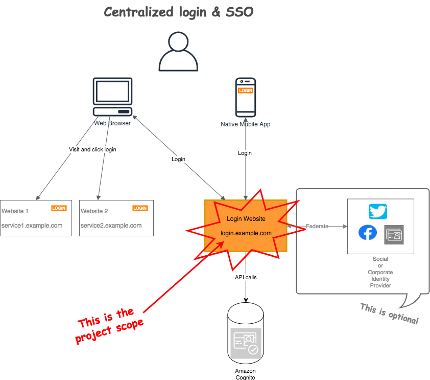
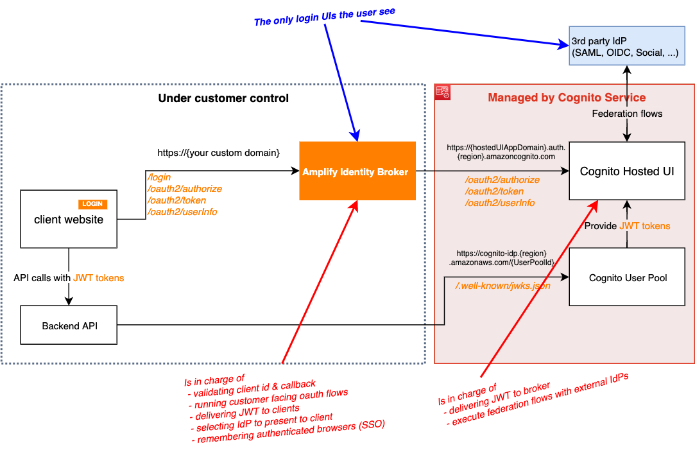
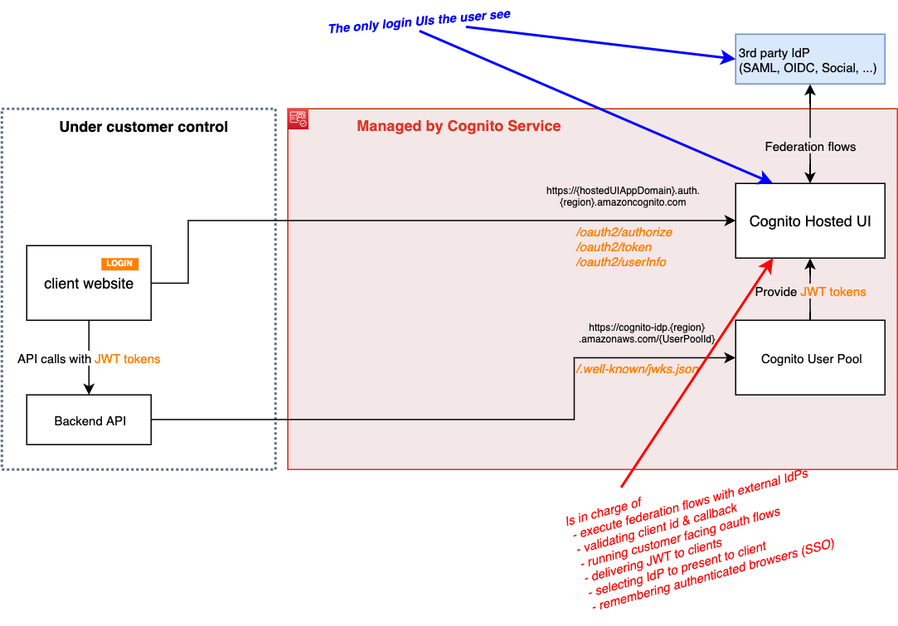
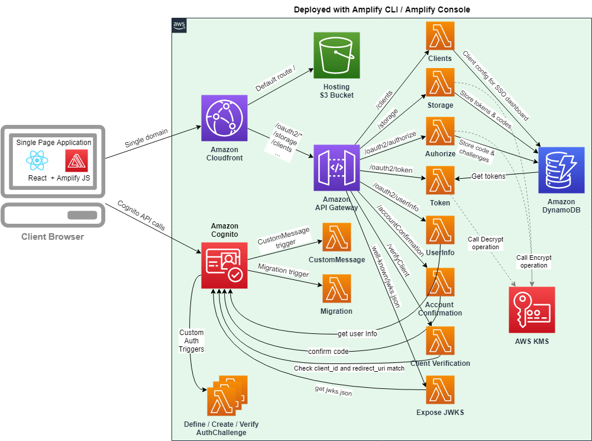

# AWS Amplify Identity Broker

This project demonstrates how to build a login application to authenticate several websites and mobile apps.

__Current features are:__

* login, forgot password ...
* is an OIDC standard Identity Provider ([with few exceptions](Documentation/UserDocumentation.md#differences-with-the-oidc-standard))
* style customization
* i18n : _languages in this demo: English and French_
* PKCE and Implicit Oauth2 flows : _for secured web and mobile application login_
* deep customization of flows and UIs
* Social login federation: _Facebook, Twitter, Amazon, Google logins_
* Corporate federation: _SAML_

__Coming soon features:__

* MFA : _SMS, OTP_
* consent approbation
* Corporate federation: _OIDC (JWT token)_
* account setting page
* SSO dashboard (listing apps)
* Migration helper

This is a simplified view of the scope of the project (what this repository is about):

The project is based on [AWS Amplify](https://aws.amazon.com/amplify/) and [Amazon Cognito](https://aws.amazon.com/cognito/). Authentication is based on standard JWT token.

## Live demo

You can sign-up, sign-in, try SSO from any of these client application demos:

* Website 1 (Implict flow) : https://master.dv7odw7xb73ou.amplifyapp.com _(this could be __yourcompany.com__)_
* Website 2 (Implict flow) : https://master.dvj34ijv8eg6m.amplifyapp.com _(this could be __portal.yourcompany.com__)_
* Website 3 (PKCE flow) :  https://master.dgt79y8acfq6b.amplifyapp.com _(this could be __www.yoursubsidiary.com__)_
* Website 4 (PKCE flow) :  https://master.d3uilst39vffn1.amplifyapp.com _(this could be __mypartner.net__)_

In a real use case, your user will only go to the broker from a client website or app, but for reference the Broker demo url itself is: 

* https://master.dw8p5s05jola3.amplifyapp.com _(this could be __login.yourcompany.com__)_

> __Demo Credentials__
> 
> For the main app you can sign-up to create your own account (_we don't use emails and phone numbers for anything else than the demo_)
> - AWS SSO SAML Demo User Credentials: __Username:__ demouser __Password:__ &7P4X^rd5fJVfd&h5h
> - OIDC Demo User Credentials: __Username:__ demo __Password:__ P@ssw0rd
> - Social login: use an account of your own

See [client demo code repository](https://github.com/awslabs/aws-amplify-identity-broker-client)

## Documentation

- __[User Documentation](Documentation/UserDocumentation.md)__ : Explains, how to deploy, how to customize the broker, how to migrate from your existing user pool system.
- __[Client Developer Documentation](Documentation/ClientDeveloperDocumentation.md)__ : Explains how to integrate the broker in your website or mobile application.
- __[Developer Documentation](Documentation/DeveloperDocumentation.md)__ : Documentation for the contributor of this project: _PR are welcome !_

### Comparison with the Amazon Cognito Hosted UI

  
Click to expand!

  
  This project is similar to the [Amazon Cognito hosted UI](https://docs.aws.amazon.com/cognito/latest/developerguide/cognito-user-pools-app-integration.html) by many aspects. Here is the list of similarities and differences.

  __Similarities__

  * both expose similar APIs : they are standard OIDC identity provider (with [few exceptions for the current project](Documentation/UserDocumentation.md#differences-with-the-oidc-standard))
  * feature scope is similar (but this project has more features)
  * both require very low effort to deploy
  * both are managed within the AWS account of the customer

  __Differences__

  * The Hosted UI is managed, you don’t have access to the code or deployment infrastructure. This project is a code project with an simplified deployment system into a Serverless infrastructure you control.
  * This project can be customized deeply. UI, languages, specific behaviors (depending on IP address, link, ...). Again since you have access to the code you can do whatever you want with it
  * This project comes with some missing feature of the Hosted UI: i18n, full CSS, JS customization, consent approbation
  * This project diverge a bit here and there of standard OAuth flows (because of some current restrictions). The limitation is in the way Oauth scope are injected in tokens and some oauth2 API are handled (see [User Documentation](Documentation/UserDocumentation.md#differences-with-the-oidc-standard)). _We are working on it to fill the gap._

  __VISUAL COMPARISON__

  with the Amplify Identity Broker:

  

  with Hosted UI only:

  

## Architecture

The project architecture is the following:

See __[Developer Documentation](Documentation/DeveloperDocumentation.md)__ to see more detailed information on every component. 

## Security

See [Security Issue Notifications](CONTRIBUTING.md#security-issue-notifications) for more information.

## License

This project is licensed under the MIT License. See the [LICENSE](LICENSE) file.
